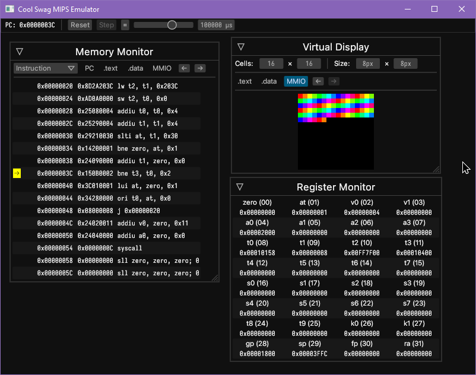

# Toy MIPS I Emulator

This is supposed to emulate a good bit of a MIPS I chip or whatever. I currently have a good bit of the main instruction set and basic syscalls implemented. I'd like to get exceptions and floating-point stuff working sometime. Maybe even a basic assembler later?

It's built in **Rust**! With **eframe**! Here's a screenshot:

## Features
- Step through code, or run at an interval
- Memory and Register monitors
- Configurable Virtual Display

## Building

You'll need [MARS](http://courses.missouristate.edu/KenVollmar/MARS/) and Java (to run MARS).

- clone the repository
- modify `program/build.sh` to point to the right paths
- assemble a MIPS program with `( cd program; ./build.sh [program] )`
	- `out.data.bin` and `out.text.bin` should appear in `program/`.
- `cargo run --release` in the repository's root to run it

No command line arguments for now.

## Credits

Well, I'm using [MARS](http://courses.missouristate.edu/KenVollmar/MARS/) as my assembler right now.

I've been using MARS' behavior as a reference, but I'm def gonna check out a few books about MIPS I to continue developing this. I'll probably use MARS' `PseudoOps.txt` too.
