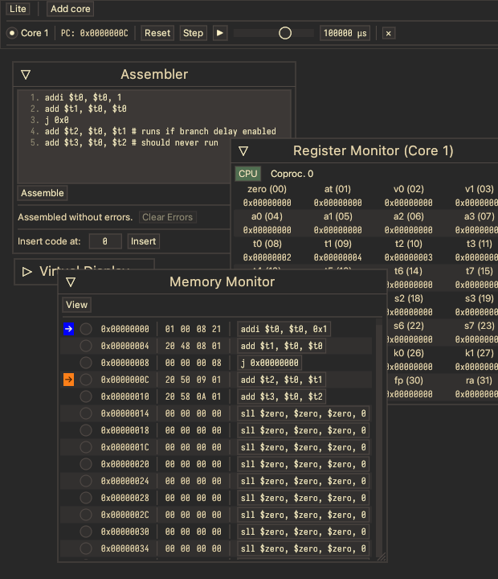

# Toy MIPS I Emulator

This is supposed to emulate a **32-bit MIPS I chip**. I currently have a good bit of the main instruction set and basic syscalls implemented. It has a basic assembler, and I'm working on adding exceptions and the floating-point coprocessor.

It's built in **Rust**! With **eframe**! Here's a few screenshots, varying in recency:

I'm able to upload the WASM version every so often, but in the future I'd still like to figure out some possible "Continuous Deployment" way of updating it.

## Features
- Step through code, or run at an interval
- Memory and Register monitors
- Configurable Virtual Display

## Roadmap

[See my To-do page!](./todo.md)

## Building

If you don't have a program already at the ready, you'll need [MARS](http://courses.missouristate.edu/KenVollmar/MARS/) and Java (to run MARS).

- clone the repository
- modify `program/build.sh` to point to the right paths
- assemble a MIPS program with `( cd program; ./build.sh [program] )`
	- `out.data.bin` and `out.text.bin` should appear in `program/`.
- `cargo run --release` in the repository's root to run it

Pretty dang soon I'm going to add the ability to build and assemble programs in the emulator itself, so this is by no means a huge dependency. <!-- actually damn it that means i need to think about adding macros. -->

No command line arguments for now.

## Resources

I'm vaguely targeting [the PlayStation 1's CPU](https://www.copetti.org/writings/consoles/playstation/#sources), but I take my own artistic license when I think it'd be cool to do [OTHER THING]. The PDFs linked in that Copetti article are very helpful.

## Credits

Well, I'm using [MARS](http://courses.missouristate.edu/KenVollmar/MARS/) as my assembler right now.

I've been using MARS' behavior as a reference, but I've been checking out a few books about MIPS I to continue developing this. I'll probably use MARS' `PseudoOps.txt` too.
